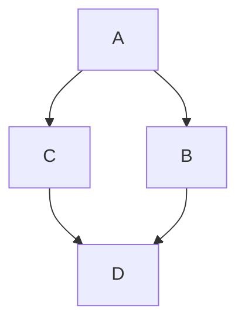
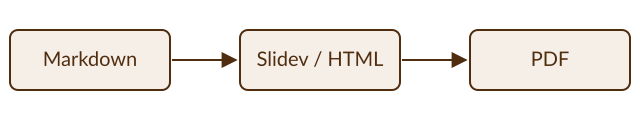

---
# The accent color (title underline, links). Quote it, because # starts a
# comment in YAML. Without this, the default from slides/style.css is used
# (here, the same Lehigh brown).
themeConfig:
  primary: '#502d0e'
---

# Example Document

Plain Markdown documents (a syllabus, a handout, an assignment) render with
`npm run lump md2pdf docs/example.md`.
The settings block at the top of this file (between the `---` lines) sets the
accent color; it is optional.

## A table

| Item | Value |
|------|-------|
| One  | 1     |
| Two  | 2     |

## Code

```js
console.log('hello');
```

## Mermaid



## SVG image

Images use paths relative to this file (here, `docs/images/pipeline.svg`):



## Math

$$
x = \frac{-b \pm \sqrt{b^2 - 4ac}}{2a}
$$
