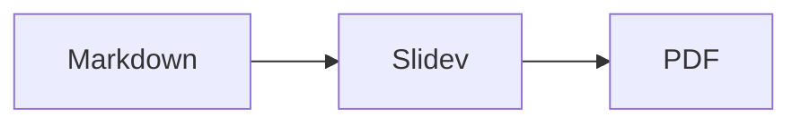
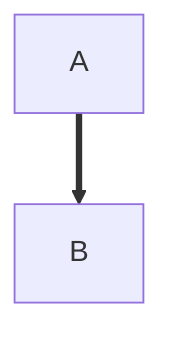

# Example Deck

## A demo of the Markdown -> slides -> PDF workflow

## Your Name

---

# Basic Slide

- Slides are separated by `---`
- Every slide needs a `# Title` line (the scripts use it to count slides)
- Presenter notes are HTML comments; `notes2pdf` collects them

<!--
These notes appear only in the notes handout, never on the slide.

- Bullets work
- So does **bold**, *italic*, and `code`
-->

---

# Code

```python
def fib(n):
    return n if n < 2 else fib(n - 1) + fib(n - 2)
```

<!--
Fenced code blocks in notes keep their text exactly, with syntax highlighting:

```python
print(fib(10))
```
-->

---

# Math

- Inline math uses single dollar signs: $ax^2 + bx + c = 0$
- Display math uses `$$` blocks:

$$
x = \frac{-b \pm \sqrt{b^2 - 4ac}}{2a}
$$

<!--
Slidev renders math with KaTeX, so any KaTeX-supported TeX works here.
-->

---

# Table

| Language | Typing  | Paradigm        |
|----------|---------|-----------------|
| Scheme   | Dynamic | Functional      |
| Java     | Static  | Object-oriented |
| Go       | Static  | Procedural      |

<!--
Tables use GitHub-flavored Markdown syntax, the same as in plain documents.
-->

---

# SVG Image


<!--
Files in slides/public/ are served from the site root, so
slides/public/images/pipeline.svg is referenced as /images/pipeline.svg.
Use Markdown image syntax for the simple case, or an  tag when you
need to control size and placement (here with UnoCSS classes).
-->

---
layout: two-cols-header
layoutClass: "!grid-rows-[auto_1fr]"
---

# Two Columns

::left::

- Left column

::right::

- Right column

---

# Diagram



<!--
Mermaid also works inside notes, but use -.-> or ==> arrows here:
a plain arrow would end this HTML comment early.



-->
